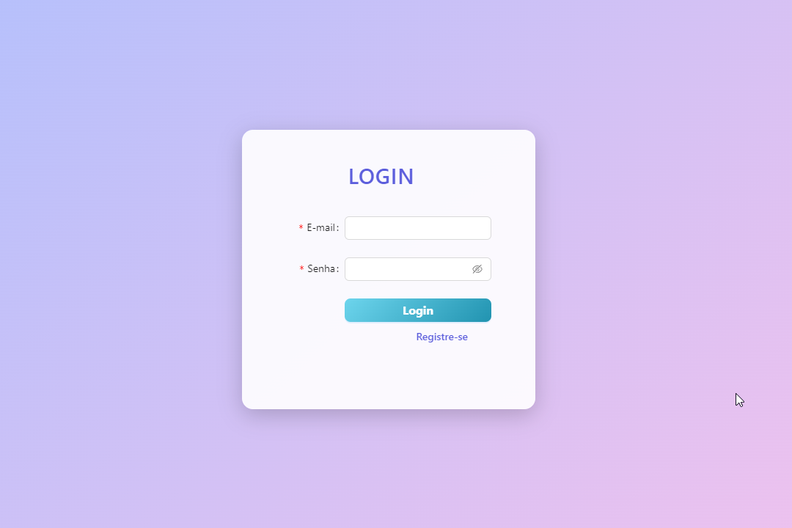

# Sistema de Gerenciamento de Multimidia




> Este é um projeto web de armazenamento de multimídias desenvolvido com Vue 3 e TypeScript. O objetivo deste projeto é estudar e aplicar conceitos de computação em nuvem e containerização, proporcionando uma plataforma robusta e escalável para o gerenciamento de arquivos multimídia.

### Ajustes e melhorias

O projeto ainda está em desenvolvimento e as próximas atualizações serão voltadas para as seguintes tarefas:

- [x] Criar tela de login
- [x] Criar tela de cadastro de usuário
- [x] Criar tela de visualizar perfil do usuário
- [ ] Criar tela de editar perfil do usuário
- [ ] Criar dashboard com listagem de arquivos
- [ ] Criar sistema de upload e download de arquivos

## 💻 Feito Com:


## 🚀 Instalando e executando o SGM

Para instalar o projeto, siga estas etapas:

```
npm install

npm run dev
```

## 💰 Donate

[](https://picpay.me/pumbadev)
[](https://nubank.com.br/pagar/1ou9f/ifu2K7YNO7)

## 📝 Licença

Copyright © 2024 Pumba Developer

[⬆ Voltar ao topo](#sgm-aws)<br>
